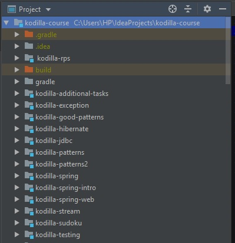

# Exercises and additional tasks performed during the course
Kurs Kodilla

## Installation
Clone this repo to your local machine using [https://github.com/PawelM-code/Pawel-Maciejewski-kodilla-java.git](https://github.com/PawelM-code/Pawel-Maciejewski-kodilla-java.git)

## Technologies
* Java 8
* Gradle
* JUnit 
* Mockito
* Hibernate
* Spring
* Spring-boot
* Stream
* MySQL
* SL4JF
* Selenium

## Additional tasks
* [Sudoku solver](https://github.com/PawelM-code/Pawel-Maciejewski-kodilla-java/tree/master/kodilla-sudoku)
* [Math parser](https://github.com/PawelM-code/Pawel-Maciejewski-kodilla-java/tree/master/kodilla-additional-tasks)

## Project structure

